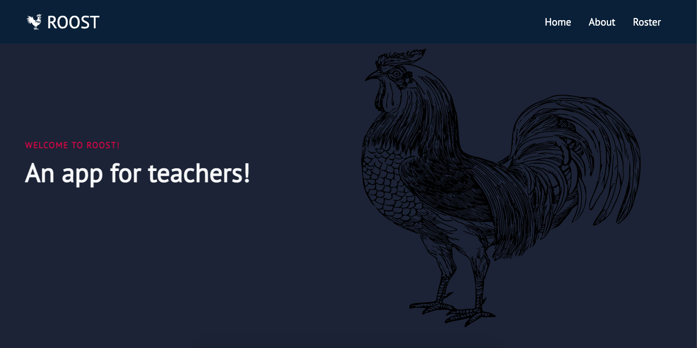
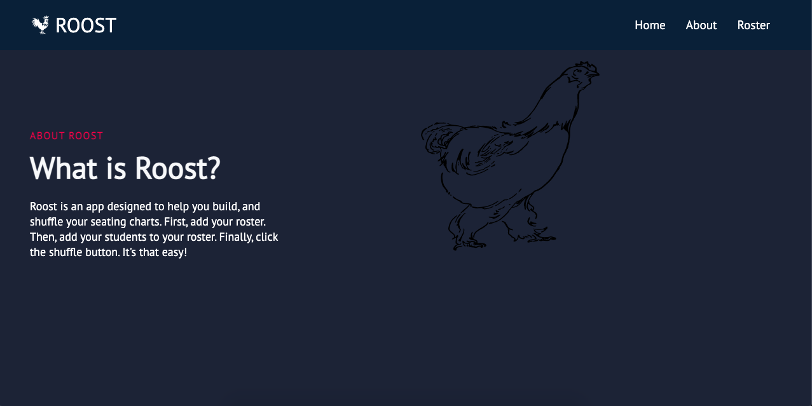
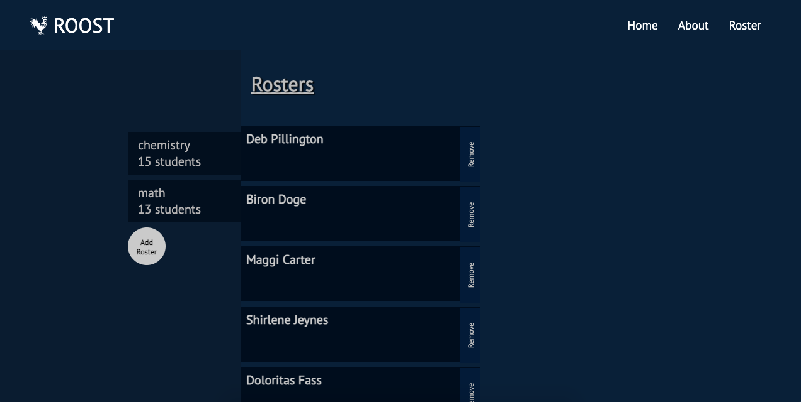
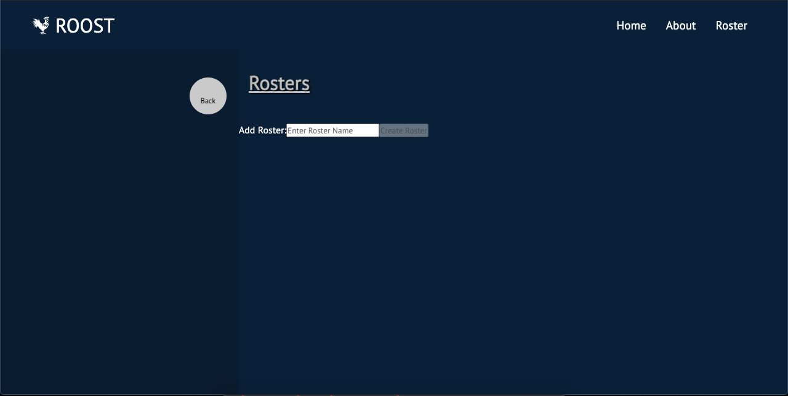
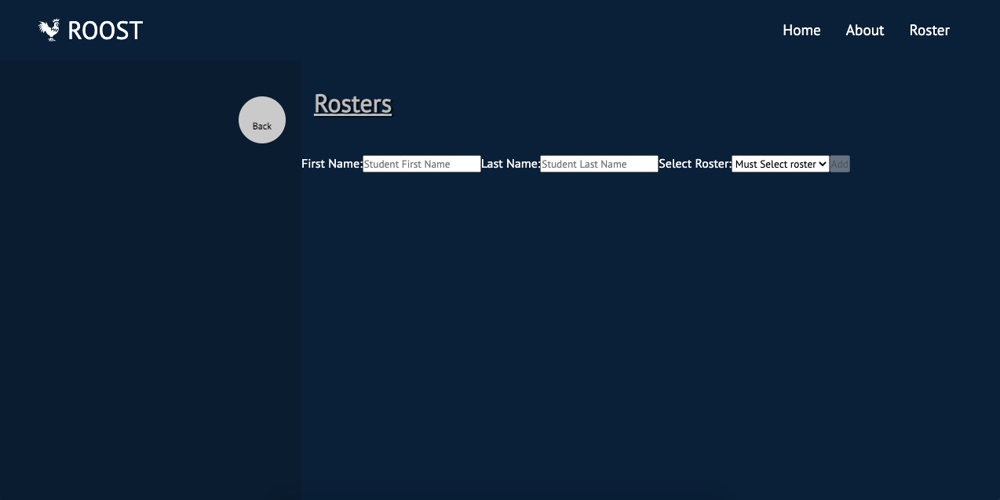

Roost API Server- An app designed for teachers to randomize seating charts.

Live Links:
React app here: https://roost-client.vercel.app/
and Node app here: https://afternoon-inlet-82835.herokuapp.com

Description:
API for Roost Application. The API stores students names, Teacher names, and classes. Together it will generate a roster that the user will be able to shuffle their students names. The Roost application is used to generate a shuffled list of names within a user created roster. A visitor and user are not required to login.

As a visitor or user, you will be able to access the home, about, and roster pages. In the home page you will be able to preview the app and decide if you would like to get started with the use of the application. 

Every User has the ability to create a roster.Within the roster a user is able to add and delete a student from their roster. Furthermore, a user is able to shuffle their list of students.

Technology Used:
Front-End: HTML5, CSS3, JavaScript ES6, React
Back-End: Node.js, Express.js, Mocha, Chai, RESTful API Endpoints, Postgres
Development Environment: Heroku, DBeaver, Vercel

https://roost-client.vercel.app/

:-------------------------:
Landing Page

On the Landing/Home page you are able to access the Home and About sections. Also, you are able to access the Roster page.

About Page

The About Page describes the purpose of the app and how to utlize the features of the app.

Roster Page

The Roster Page displays the rosters on the left hand side. Followed by the Add Roster Button. It also shows the entire list of students. The user can also view the Add Student and Shuffle button at the bottom of the student list. 

Add Roster Page

The Add Roster Page allows the user to enter the name of their roster. The user is able to click on the create roster button once there is some data that is entered. This page also features a Back button that returns to the main Roster Page. 

Add Student Page

The Add Student Page allows the user to input the name of their student. It also features a drop down menu offering the different rosters to add their student too. Once a roster is selected, the user is able to add the student to the roster. This page also features a back button returning the user to the main Roster Page.

